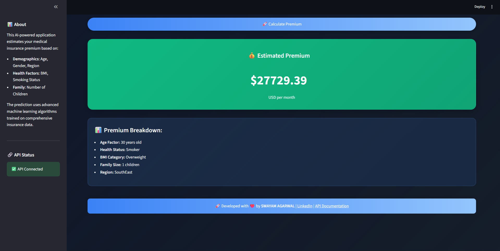

# 🏥 Medical Insurance Premium Prediction App

This repository contains a comprehensive **Medical Insurance Premium Prediction** system with both a **Streamlit web application** and a **FastAPI backend**. The project leverages multiple Machine Learning algorithms to predict insurance premiums based on user demographics and health factors.

---

## 🌟 Features

### **Frontend (Streamlit App)**
- **Modern UI/UX**: Beautiful, responsive interface with dark theme and medical styling
- **Real-Time Predictions**: Instant premium predictions with API integration
- **Interactive Visualizations**: Model performance comparisons and insights
- **User-Friendly Input**: Intuitive form with validation and helpful tooltips

### **Backend (FastAPI)**
- **RESTful API**: Production-ready API deployed on Railway
- **Model Serving**: Loads trained ML model for predictions
- **Input Validation**: Pydantic models for data validation
- **Health Checks**: API status monitoring endpoints

### **Machine Learning**
- **Multiple Algorithms**: Random Forest, Gradient Boosting, XGBoost comparison
- **Model Performance**: Comprehensive evaluation metrics (R² scores, RMSE)
- **Trained Model**: Pre-trained model included (`Insurance_ML.pkl`)
- **Dataset**: Complete insurance dataset (`insurance.csv`)

---

## 📁 Repository Structure

```
Medical_Insurance_premium_ML/
├── App.py                                    # Streamlit frontend application
├── FAPI_MED.py                              # FastAPI backend server
├── Insurance_ML.pkl                         # Trained machine learning model
├── insurance.csv                            # Complete dataset (1,340 records)
├── Medical_Insurance_Premium_Predicting_Model.ipynb  # Jupyter notebook with ML pipeline
├── Medical Insurance Price Prediction using Machine Learning.py  # Standalone ML script
├── requirements.txt                         # Python dependencies
├── README.md                               # This file
├── .gitignore                              # Git ignore patterns
├── Model_Performance.png                   # Model comparison visualization
├── Preview_1.png                           # App interface preview
├── Preview_2.png                           # Additional app preview
└── .MED/                                   # Virtual environment
```

---

## 🧩 Technologies Used

### **Frontend & Web**
- **Streamlit** - Interactive web application
- **HTML/CSS** - Custom styling and theming

### **Backend & API**
- **FastAPI** - Modern, fast web framework
- **Uvicorn** - ASGI server
- **Pydantic** - Data validation

### **Machine Learning**
- **Scikit-Learn** - ML algorithms and preprocessing
- **XGBoost** - Gradient boosting
- **Pandas** - Data manipulation
- **NumPy** - Numerical computing

### **Deployment**
- **Railway** - Cloud deployment platform
- **Pickle** - Model serialization

---

## 🎯 Quick Start

### **Option 1: Run the Streamlit App (Recommended)**

1. **Clone the Repository**:
   ```bash
   git clone https://github.com/SwayamAg/Medical-Insurance-Premium-Prediction.git
   cd Medical-Insurance-Premium-Prediction
   ```

2. **Install Dependencies**:
   ```bash
   pip install -r requirements.txt
   ```

3. **Run the Streamlit App**:
   ```bash
   streamlit run App.py
   ```

4. **Access the App**: Open your browser to `http://localhost:8501`

### **Option 2: Use the FastAPI Backend**

1. **Install Dependencies**:
   ```bash
   pip install -r requirements.txt
   ```

2. **Run the FastAPI Server**:
   ```bash
   python FAPI_MED.py
   ```

3. **Access the API**:
   - API Documentation: `http://localhost:8080/docs`
   - Health Check: `http://localhost:8080/`
   - Prediction Endpoint: `http://localhost:8080/predict`

### **Option 3: Production API**

The FastAPI backend is deployed on Railway and available at:
- **API Base URL**: `https://f-api-production.up.railway.app`
- **API Documentation**: `https://f-api-production.up.railway.app/docs`

---

## 🔍 How It Works

### **Data Input**
The system accepts the following parameters:
- **Age**: Customer's age (18-64)
- **Sex**: Gender (male/female)
- **BMI**: Body Mass Index (10-50)
- **Children**: Number of dependents (0-5)
- **Smoker**: Smoking status (yes/no)
- **Region**: Geographic region (northwest/northeast/southeast/southwest)

### **Prediction Process**
1. User inputs demographic and health data
2. Data is validated and preprocessed
3. Categorical variables are encoded
4. Trained ML model makes prediction
5. Premium amount is returned to user

### **Model Performance**
The system includes multiple ML models with performance comparisons:
- **Random Forest**: High accuracy and interpretability
- **Gradient Boosting**: Excellent predictive power
- **XGBoost**: State-of-the-art performance

---

## 📊 Dataset Information

The `insurance.csv` dataset contains **1,340 records** with the following features:
- **age**: Age of the insured person
- **sex**: Gender of the insured person
- **bmi**: Body Mass Index
- **children**: Number of children/dependents
- **smoker**: Smoking status
- **region**: Geographic region
- **charges**: Insurance premium (target variable)

---

## 🚀 Deployment

### **Frontend Deployment**
The Streamlit app can be deployed on:
- **Streamlit Cloud**
- **Heroku**
- **Railway**
- **AWS/GCP/Azure**

### **Backend Deployment**
The FastAPI backend is currently deployed on **Railway**:
- **Production URL**: `https://f-api-production.up.railway.app`
- **Auto-scaling**: Handles traffic automatically
- **SSL Certificate**: HTTPS enabled

---

## 📸 Screenshots

### **Streamlit Interface**


### **Streamlit Interface (Prediction)**


### **Model Performance**


---

## 🔧 Development

### **Local Development Setup**
1. Create a virtual environment:
   ```bash
   python -m venv .MED
   source .MED/bin/activate  # On Windows: .MED\Scripts\activate
   ```

2. Install development dependencies:
   ```bash
   pip install -r requirements.txt
   ```

3. Run tests and development server:
   ```bash
   # Frontend
   streamlit run App.py
   
   # Backend
   python FAPI_MED.py
   ```

### **Model Training**
To retrain the model:
1. Open `Medical_Insurance_Premium_Predicting_Model.ipynb`
2. Run all cells to train new models
3. Save the best model as `Insurance_ML.pkl`

---

## 📝 API Documentation

### **Endpoints**

#### **GET /** - Health Check
Returns API status
```json
{
  "message": "Medical Insurance Premium Predictor API is running."
}
```

#### **POST /predict** - Make Prediction
Input:
```json
{
  "age": 25,
  "sex": "male",
  "bmi": 28.5,
  "children": 0,
  "smoker": "no",
  "region": "northwest"
}
```

Output:
```json
{
  "predicted_premium": 2840.50
}
```

---

## 🤝 Contributing

1. **Fork** the repository
2. **Create** a feature branch (`git checkout -b feature/AmazingFeature`)
3. **Commit** your changes (`git commit -m 'Add some AmazingFeature'`)
4. **Push** to the branch (`git push origin feature/AmazingFeature`)
5. **Open** a Pull Request

---

## 📄 License

This project is licensed under the **MIT License** - see the [LICENSE](LICENSE) file for details.

---

## 👨‍💻 Author

**Swayam Agrawal**
- GitHub: [@SwayamAg](https://github.com/SwayamAg)
- Repository: [Medical-Insurance-Premium-Prediction](https://github.com/SwayamAg/Medical-Insurance-Premium-Prediction)

---

## 🙏 Acknowledgments

- Dataset source and contributors
- Streamlit and FastAPI communities
- Machine Learning community for algorithms and techniques

---

**⭐ Star this repository if you find it helpful!**
